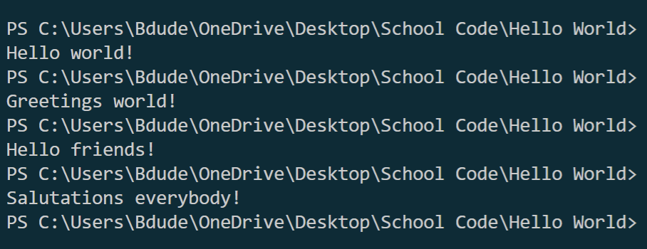

# Overview

This software uses Python to display a random message to say hello to the world!

This software was created so I could practice using python to do simple tasks in my Development Environment.

[Software Demo Video](https://youtu.be/IMEoUEVQWUs)

# Development Environment

* Python 3.10.1 64-bit
* Visual Studio Code
* Git / GitHub

# Useful Websites

* [Github](http://github.com)

# Output Example
